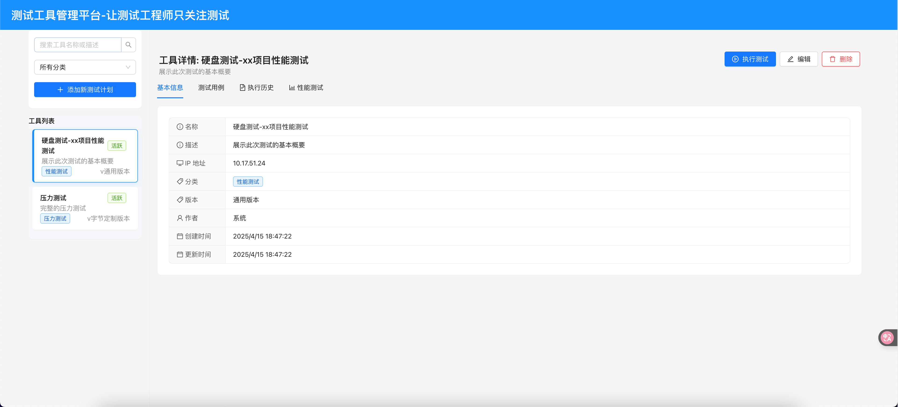
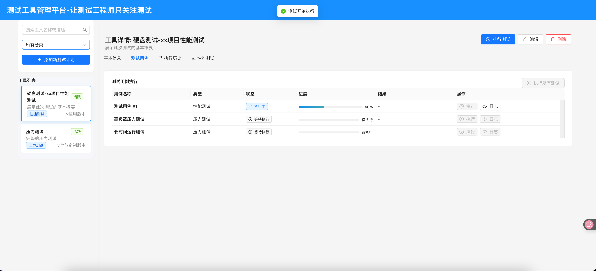
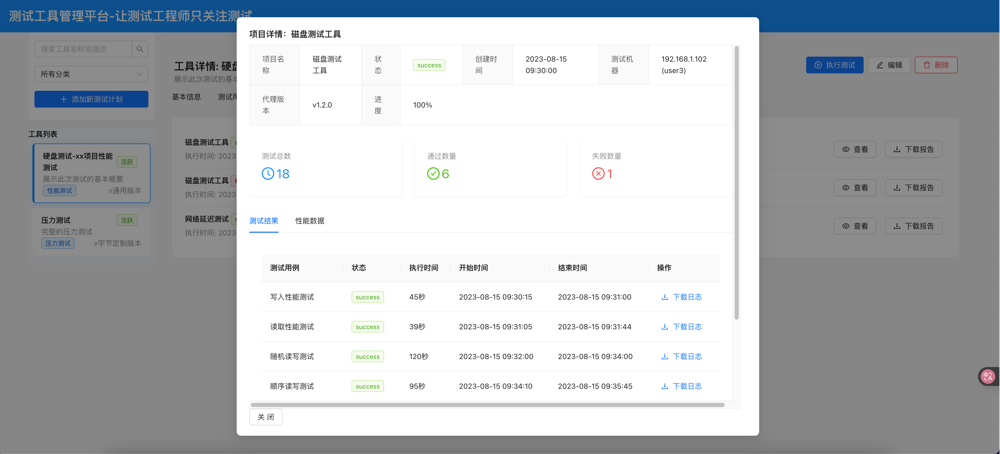

# 测试工具管理平台

测试工具管理平台是一个专为测试工程师设计的集中化测试工具管理系统，提供各类测试工具的注册、管理、执行和监控功能。



## 项目简介

本项目旨在解决测试工程师在日常工作中面临的工具分散、管理混乱、使用效率低下等问题，提供一站式测试工具管理解决方案。主要功能包括：

- 测试工具注册与管理
- 性能测试工具集成
- 硬盘测试功能
- 压力测试功能
- 测试历史记录与报告生成
- 多版本测试工具支持

## 技术栈

### 后端
- **FastAPI**: 高性能的Python API框架
- **SQLModel**: 结合了SQLAlchemy和Pydantic的ORM工具
- **Pydantic**: 数据验证和设置管理
- **Uvicorn**: ASGI服务器

### 前端
- **React 18**: 用户界面库
- **Ant Design (antd)**: UI组件库
- **TypeScript**: 类型安全的JavaScript超集
- **Vite**: 现代前端构建工具

### 代理端
- **Go语言**: 用于开发高性能的数据采集代理
- 支持跨平台部署，负责从目标机器采集测试数据

## 项目结构

```
CommonTestManagerServer/
├── backend/                # 后端代码
│   ├── app/                # 应用主目录
│   ├── models/             # 数据模型
│   ├── utils/              # 工具函数
│   ├── main.py             # 程序入口
│   └── requirement.txt     # 依赖管理
├── front/                  # 前端代码
│   ├── src/                # 源代码
│   ├── public/             # 静态资源
│   └── package.json        # 前端依赖
└── AgentGo/                # Go语言编写的代理端
    ├── cmd/                # 命令行入口
    ├── handlers/           # 请求处理
    ├── models/             # 数据模型
    └── utils/              # 工具函数
```

## 安装与运行

### 后端

```bash
# 进入后端目录
cd backend

# 创建虚拟环境
python -m venv .venv

# 激活虚拟环境
# Windows
.venv\Scripts\activate
# Linux/Mac
source .venv/bin/activate

# 安装依赖
pip install -r requirement.txt

# 启动服务
python main.py
```

### 前端

```bash
# 进入前端目录
cd front

# 安装依赖
npm install
# 或使用 pnpm
pnpm install

# 开发模式运行
npm run dev
# 或
pnpm dev

# 构建生产版本
npm run build
# 或
pnpm build
```

### 代理端

```bash
# 进入代理端目录
cd AgentGo

# 构建
go build -o agent ./cmd

# 运行
./agent
```

## 贡献指南

欢迎通过以下方式为项目做出贡献：

1. Fork 仓库
2. 创建特性分支 (`git checkout -b feature/amazing-feature`)
3. 提交更改 (`git commit -m 'Add some amazing feature'`)
4. 推送到分支 (`git push origin feature/amazing-feature`)
5. 创建 Pull Request

## 许可证

MIT

## 鸣谢

特别感谢以下技术和工具的大力支持：
- **Python**：作为核心开发语言，提供了高效且灵活的编程环境
- **FastAPI**：高性能API框架，显著提升了后端开发效率和系统响应速度
- **Cursor**：智能编辑器，带来了优质的代码补全和开发体验
- **Claude**：出色的AI助手，为解决技术难题提供了宝贵支持
- 参考仓库：https://github.com/fastapi/full-stack-fastapi-template