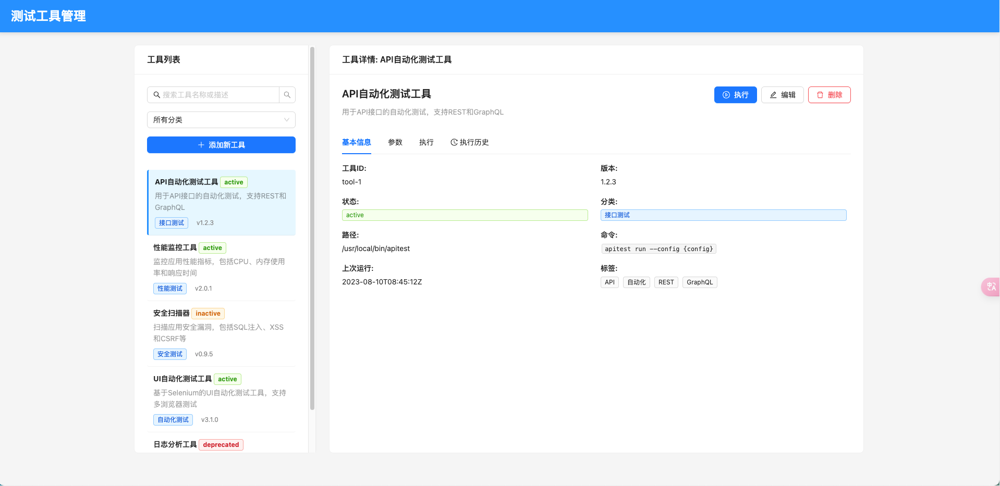

# 测试工具管理系统

一个用于管理和执行各种测试工具的React单页面应用程序。


## 功能特点

- 集中管理各种测试工具
- 可视化工具执行界面
- 工具执行历史记录
- 参数化配置和执行
- 响应式设计，适配各种设备

## 技术栈

- React 18
- TypeScript
- Ant Design
- React Router
- Axios
- Vite

## 开发环境设置

### 前提条件

- Node.js 18+
- pnpm 8+

### 安装

```bash
# 克隆仓库
git clone https://github.com/hankerbiao/test-tool-manager.git
cd test-tools-manager

# 安装依赖
pnpm install
```

### 开发服务器

```bash
pnpm dev
```

访问 http://localhost:5173 查看应用。

### 构建生产版本

```bash
pnpm build
```

### 预览生产版本

```bash
pnpm preview
```

## 项目结构

```
test-tools-manager/
├── public/           # 静态资源
├── src/              # 源代码
│   ├── api/          # API服务
│   ├── assets/       # 资源文件
│   ├── components/   # 组件
│   ├── config/       # 配置
│   ├── hooks/        # 自定义hooks
│   ├── layouts/      # 布局组件
│   ├── pages/        # 页面
│   ├── styles/       # 样式
│   ├── types/        # 类型定义
│   ├── utils/        # 工具函数
│   ├── App.tsx       # 应用入口
│   └── main.tsx      # 渲染入口
├── .eslintrc.js      # ESLint配置
├── .gitignore        # Git忽略文件
├── index.html        # HTML入口
├── package.json      # 项目配置
├── README.md         # 项目说明
├── tsconfig.json     # TypeScript配置
└── vite.config.ts    # Vite配置
```

## 使用指南

### 添加新工具

1. 点击工具列表中的"添加新工具"按钮
2. 填写工具信息，包括名称、描述、版本、状态等
3. 配置工具参数
4. 点击保存

### 执行工具

1. 从工具列表中选择一个工具
2. 点击"执行"按钮或切换到"执行"选项卡
3. 填写执行参数
4. 点击"执行工具"按钮
5. 查看执行结果

## API集成

本应用设计为可以与后端API集成。目前使用模拟数据进行开发和演示。若要连接实际API，请修改`src/api/toolsApi.ts`文件中的实现。

